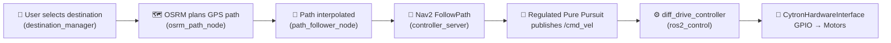

# Chitti Robot – Capability Assessment

## The Big Question
> *"If I give it a start and goal point, can it drive there on its own?"*

**Short answer: Almost, but not yet.** You have ~80% of the pipeline built. There are 2-3 integration gaps that would prevent it from working end-to-end on real hardware today.

---

## What You HAVE (Working Pipeline)

| Layer | Component | Status |
|-------|-----------|--------|
| **Destination Selection** | `destination_manager_node` | ✅ Maps location IDs → GPS coords, publishes to `/goal_gps` |
| **Path Planning** | `osrm_path_node` | ✅ Downloads OSM road graph, computes shortest path, publishes `/global_path` in map frame |
| **Path Following Bridge** | `path_follower_node` | ✅ Interpolates sparse path → dense path, sends to Nav2 `FollowPath` action |
| **Nav2 Controller** | `controller_server` (Regulated Pure Pursuit) | ✅ Follows path, outputs `/cmd_vel` |
| **Motor Control** | `diff_drive_controller` + `CytronHardwareInterface` | ✅ Converts `/cmd_vel` → wheel PWM on GPIO |
| **Localization** | EKF + NavSat Transform | ✅ Config exists for fusing GPS (`/fix`) + IMU (`/imu/data`) → `/odometry/filtered` |
| **Robot Model** | URDF with 4 wheels, GPS link, IMU link | ✅ Complete with `ros2_control` tags |
| **Tours** | `waypoint_manager_node` | ✅ Pre-defined multi-stop campus tours |

---

## What's MISSING (The Gaps)

### 🔴 Gap 1: No Real Sensor Drivers
Currently `sensors.launch.py` is a **stub** – it just runs the diagnostics node. You need actual ROS 2 driver nodes for:

| Sensor | What's needed | ROS 2 Package |
|--------|--------------|---------------|
| **GPS (NEO-6M)** | Driver that reads NMEA from serial → publishes `sensor_msgs/NavSatFix` on `/fix` | `nmea_navsat_driver` |
| **IMU (MPU9250)** | Driver that reads I2C/SPI → publishes `sensor_msgs/Imu` on `/imu/data` | `mpu9250driver` or custom |

Without these, the EKF has no inputs and the robot has no idea where it is.

### 🔴 Gap 2: `hardware.launch.py` is NOT wired into `navigation.launch.py`
Right now you have two **separate** launch files:
- `navigation.launch.py` – starts localization + Nav2 + path planning (but uses `fake_sensors`)
- `hardware.launch.py` – starts `ros2_control` + motor drivers

These need to be combined into a single **"real robot"** launch that:
1. Starts real sensor drivers (GPS + IMU) instead of fake sensors
2. Starts the `ros2_control` stack (controller_manager + diff_drive_controller)
3. Starts the Nav2 + path planning stack
4. **Removes** the static `map→odom` TF (the EKF should compute this dynamically)

### 🟡 Gap 3: Odometry Source Conflict
The EKF config (`ekf.yaml`) currently fuses:
- `odom0: /odometry/gps` (from navsat_transform)
- `imu0: /imu/data`

But it does **NOT** fuse wheel odometry from `diff_drive_controller` (which publishes on `/odom`). Adding wheel odom as a third input would significantly improve localization smoothness between GPS fixes.

### 🟡 Gap 4: Static `map→odom` TF
`navigation.launch.py` line 38-47 publishes a **hardcoded** static transform from `map→odom`. This is fine for simulation but on a real robot, this transform should come from the localization system (EKF or AMCL). Since you're using GPS-based localization, the `navsat_transform_node` should handle this.

---

## Summary Scorecard

| Capability | Real Hardware Ready? |
|-----------|---------------------|
| Plan a road-constrained path from A → B | ✅ Yes |
| Visualize path + map in RViz | ✅ Yes |
| Drive motors from `/cmd_vel` | ✅ Yes (after setting GPIO pins) |
| Know where the robot is (localization) | ❌ No – needs real sensor drivers |
| Autonomously navigate A → B end-to-end | ❌ No – needs integrated launch + sensors |
| Obstacle avoidance | ❌ No – obstacle layers are disabled, no LIDAR |

## What to Build Next (Priority Order)

1. **Real sensor drivers** – Wire up GPS + IMU driver nodes in `sensors.launch.py`
2. **Unified real-robot launch file** – Combine hardware + navigation + sensors (with `use_fake_sensors:=false`)
3. **Add wheel odom to EKF** – Fuse `/odom` from `diff_drive_controller` for smoother localization
4. **Remove static map→odom TF** – Let EKF/navsat handle it dynamically
5. **Set real GPIO pins** in the URDF and rebuild with `-DUSE_PIGPIO=ON`
6. *(Optional)* Add a LIDAR for obstacle avoidance
